# Market Basket Analysis with Python - Amazon

## 📌 Project Overview

This project analyzes Amazon customer shopping behavior using Python. It focuses on customer demographics, purchasing behavior, product categories, search methods, cart abandonment, customer segmentation, satisfaction, reviews, personalized recommendations, service appreciation, and areas for improvement.

The project also uses **K-Means clustering**, an unsupervised machine learning technique, to identify groups of customers with similar behavior based on selected satisfaction and rating-related features.

---

## 🎯 Project Objectives

The main objectives of this project are:

- Clean and prepare the Amazon customer dataset
- Analyze customer demographics
- Analyze purchase frequency and shopping behavior
- Identify the most popular product categories
- Analyze product search methods
- Identify major cart abandonment factors
- Analyze customer satisfaction
- Create customer profiles based on purchase frequency
- Analyze customer segments by gender
- Apply K-Means clustering to customer behavior
- Analyze recommendation helpfulness and shopping satisfaction
- Analyze review reliability and helpfulness
- Analyze personalized recommendation responses
- Identify the services most appreciated by customers
- Identify areas where customers feel improvement is required
- Create visualizations to communicate the findings

---

## 🛠️ Technologies Used

- Python
- Pandas
- NumPy
- Matplotlib
- Seaborn
- Scikit-learn
- Jupyter Notebook

---

## 📂 Project Structure

    MarketBasketAnalysis/
    │
    ├── Amazon.csv
    ├── Market_Basket_Analysis_Amazon.ipynb
    ├── README.md
    │
    └── images/
        ├── age_distribution.png
        ├── browsing_frequency_pie_chart.png
        ├── cart_abandonment_factors.png
        ├── customer_segments.png
        ├── customer_segments_by_gender.png
        ├── gender_distribution.png
        ├── improvement_areas.png
        ├── kmeans_clusters.png
        ├── most_popular_product_categories.png
        ├── personalized_recommendation_responses.png
        ├── product_search_methods.png
        ├── purchase_categories_bar_chart.png
        ├── purchase_frequency_distribution.png
        ├── recommendation_helpfulness_vs_satisfaction.png
        ├── recommendation_satisfaction_heatmap.png
        ├── review_helpfulness.png
        ├── review_reliability.png
        ├── service_appreciation.png
        └── shopping_satisfaction_levels.png

---

# 📊 Dataset

The project uses the `Amazon.csv` dataset containing Amazon customer responses.

### Dataset Size

- **800 rows**
- **24 columns**

### Main Dataset Information

The dataset contains information related to:

- Customer age
- Gender
- Purchase frequency
- Purchase categories
- Personalized recommendation response
- Browsing frequency
- Product search method
- Search result exploration
- Customer reviews importance
- Add-to-cart browsing
- Cart completion frequency
- Cart abandonment factors
- Save-for-later frequency
- Review left
- Review reliability
- Review helpfulness
- Personalized recommendation rating
- Recommendation helpfulness
- Rating accuracy
- Shopping satisfaction
- Service appreciation
- Improvement areas
- Transaction

---

# 🧹 Task 1: Data Cleaning and Preparation

The dataset was first inspected and prepared before performing the analysis.

### Data Inspection

The following checks were performed:

- Dataset shape
- Column names
- Data types
- Descriptive statistics
- Duplicate records
- Missing values

### Column Cleaning

Leading and trailing spaces were removed from the column names.

The dataset columns were standardized as:

- `Timestamp`
- `age`
- `Gender`
- `Purchase_Frequency`
- `Purchase_Categories`
- `Personalized_Recommendation_Response`
- `Browsing_Frequency`
- `Product_Search_Method`
- `Search_Result_Exploration`
- `Customer_Reviews_Importance`
- `Add_to_Cart_Browsing`
- `Cart_Completion_Frequency`
- `Cart_Abandonment_Factors`
- `Saveforlater_Frequency`
- `Review_Left`
- `Review_Reliability`
- `Review_Helpfulness`
- `Personalized_Recommendation_Rating`
- `Recommendation_Helpfulness`
- `Rating_Accuracy`
- `Shopping_Satisfaction`
- `Service_Appreciation`
- `Improvement_Areas`
- `transaction`

### Missing Value Handling

Missing values were checked across the dataset.

The missing values in `Product_Search_Method` were handled using the **mode** of the column.

### Categorical Data Cleaning

Leading and trailing spaces were removed from categorical columns to standardize their values.

### Rating Conversion

The following rating-related columns were converted to numeric data types:

- `Customer_Reviews_Importance`
- `Personalized_Recommendation_Rating`
- `Rating_Accuracy`
- `Shopping_Satisfaction`

---

# 📈 Task 2: Descriptive Behavior Analysis

## 👤 Customer Demographics Analysis

### Age Distribution

The age distribution of customers was analyzed using descriptive statistics and a histogram.

The dataset contains customers between **3 and 67 years of age**, with an average age of approximately **35 years**.

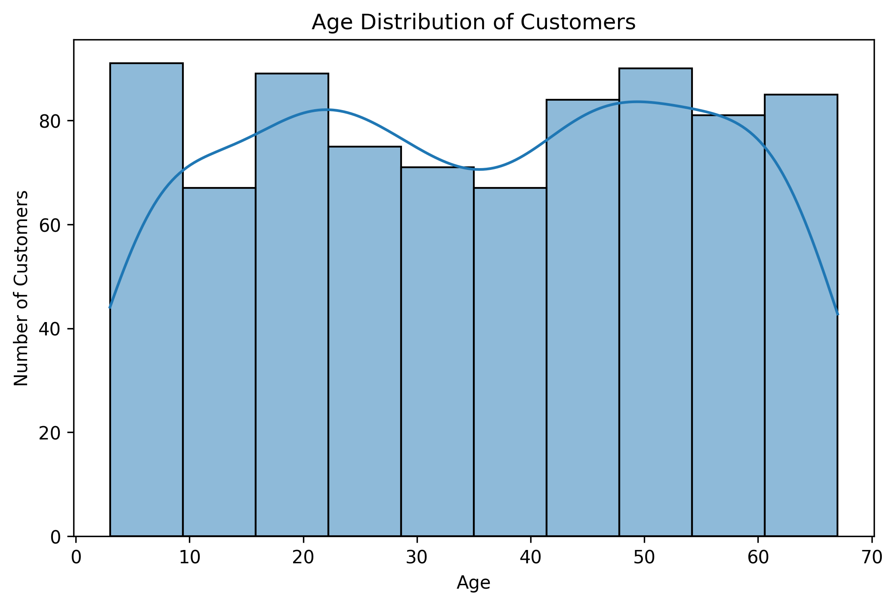

### Gender Distribution

The gender distribution was analyzed using value counts and a count plot.

### Key Findings

- Male respondents represent the largest group with **209 customers**.
- The distribution is fairly balanced across the four gender categories.
- **Prefer not to say** has **192 customers**.

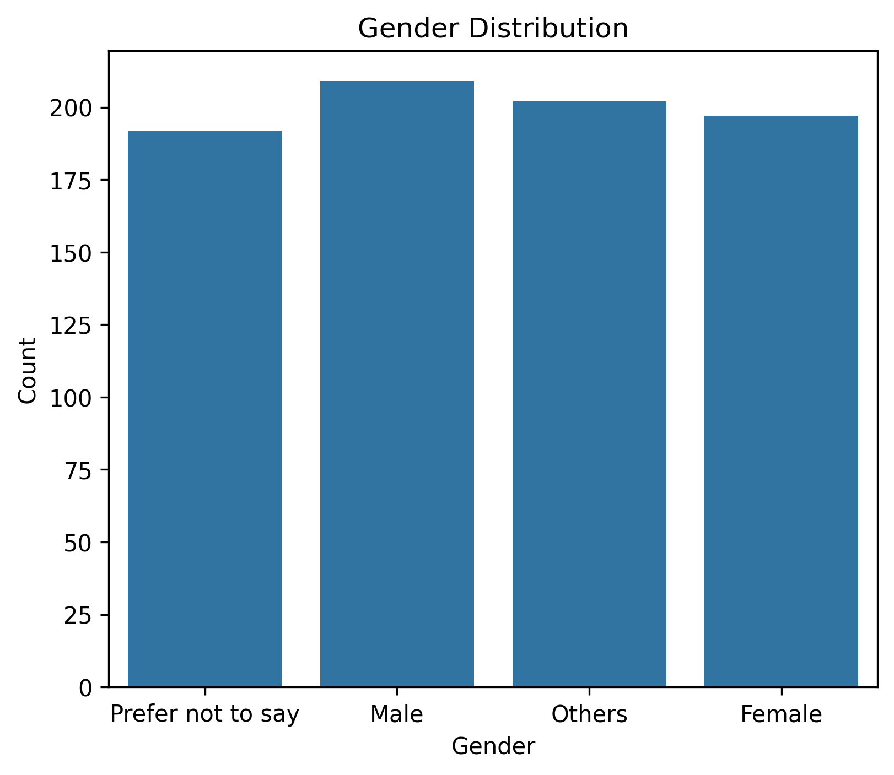

---

## 🛒 Purchase Frequency Analysis

Customer purchase frequency was analyzed to understand how regularly customers purchase products.

### Key Findings

- **Once a month** is the most common purchase frequency with **168 customers**.
- The five purchase frequency categories are distributed relatively evenly.
- The dataset contains customers with different shopping patterns.

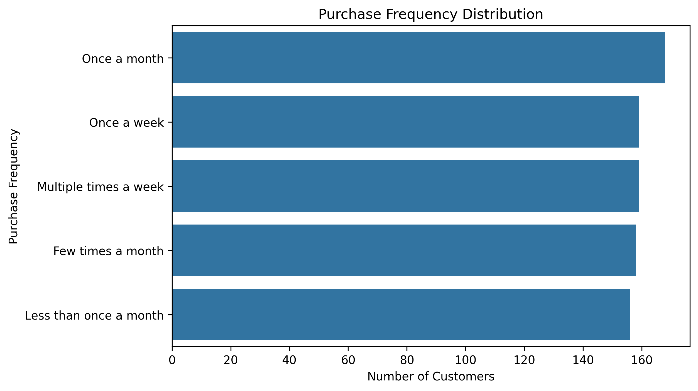

---

## 🛍️ Most Popular Product Categories

The `Purchase_Categories` column contains multiple product categories separated by semicolons.

The categories were separated using `split()` and expanded using `explode()` so that individual category selections could be counted.

### Key Findings

- **Clothing and Fashion** is the most popular category with **450 selections**.
- **Others** is the second most selected category with **412 responses**.
- **Home and Kitchen** has **391 responses**.
- **Beauty and Personal Care** has **383 responses**.
- **Groceries and Gourmet Food** has **369 responses**.

Overall, Clothing and Fashion is the most frequently selected shopping category in the dataset.

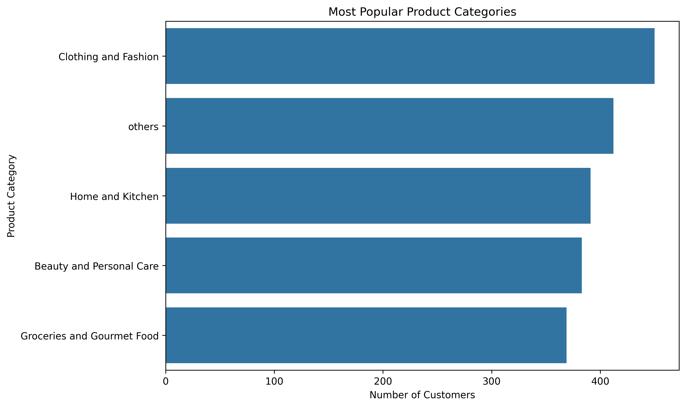

---

## 🔎 Product Search Methods

Different methods used by customers to search for products were analyzed.

### Key Findings

- **Keyword** is the most commonly used search method with **327 customers**.
- **Categories** is used by **163 customers**.
- **Filter** is used by **161 customers**.
- **Others** is used by **149 customers**.

This indicates that keyword-based searching is the most commonly used product search method among the surveyed customers.

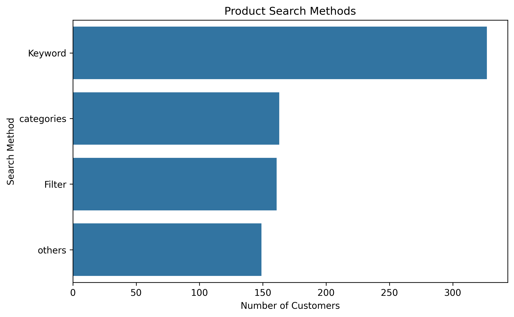

---

## 🛒 Cart Abandonment Factors

The project analyzes the reasons customers abandon their shopping carts.

### Key Findings

- **High shipping costs:** 224 responses
- **Found a better price elsewhere:** 206 responses
- **Changed my mind or no longer need the item:** 194 responses
- **Other:** 176 responses

High shipping costs are the leading cart abandonment factor in the analyzed dataset.

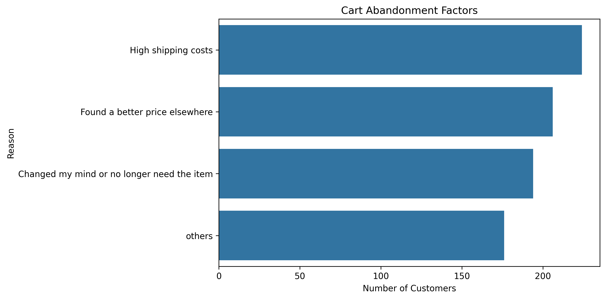

---

## 📊 Mean and Median Analysis

Mean and median values were calculated for:

- Shopping Satisfaction
- Rating Accuracy
- Personalized Recommendation Rating

### Results

| Metric | Mean | Median |
|---|---:|---:|
| Shopping Satisfaction | 3.01 | 3 |
| Rating Accuracy | 2.97 | 3 |
| Personalized Recommendation Rating | 2.95 | 3 |

The mean and median values are close to each other, with responses centered around the middle of the rating scale.

---

## 📋 Summary Statistics

The numerical variables analyzed include:

- Age
- Customer Reviews Importance
- Personalized Recommendation Rating
- Rating Accuracy
- Shopping Satisfaction

### Key Findings

- The dataset contains **800 customer responses**.
- Customer ages range from **3 to 67 years**.
- The average customer age is approximately **35 years**.
- Average scores for the rating-related variables are close to **3**.
- Overall, the numerical variables show moderate customer perceptions and satisfaction levels.

---

# 👥 Task 3: Customer Segmentation and Profiling

## Purchase Frequency and Shopping Satisfaction

Purchase frequency and shopping satisfaction were analyzed together using frequency counts and cross-tabulation.

This analysis helps examine how shopping satisfaction is distributed across different purchase-frequency categories.

---

## Customer Profiles

Customers were grouped into three segments using their purchase frequency.

### 1. Frequent Buyers

Customers whose purchase frequency is:

**Multiple times a week**

- **159 customers**

### 2. Occasional Shoppers

Customers whose purchase frequency is:

- Few times a month
- Once a month
- Once a week

- **485 customers**

### 3. At-Risk Customers

Customers belonging to the remaining lower-frequency purchase category.

- **156 customers**

### Key Findings

- Occasional Shoppers form the largest customer segment with **485 customers**.
- Frequent Buyers account for **159 customers**.
- At-Risk Customers account for **156 customers**.

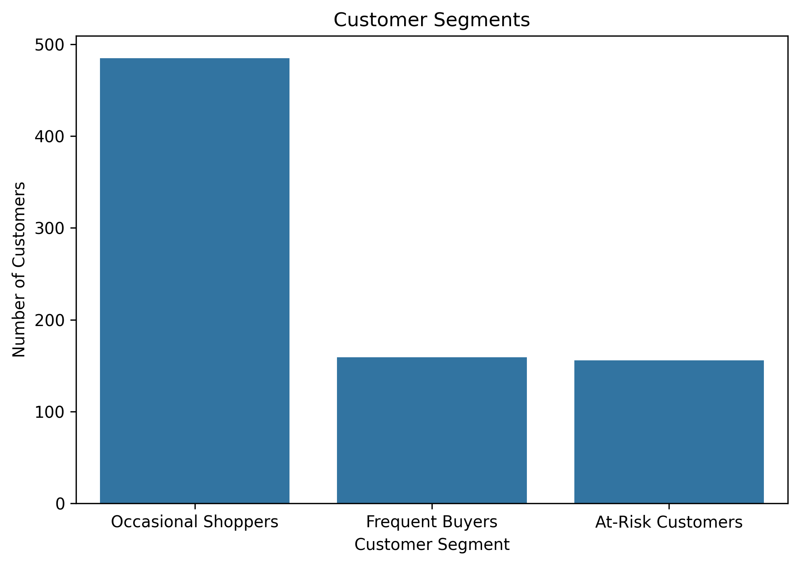

---

## Demographic Analysis of Customer Segments

Customer segments were further analyzed by gender.

### Key Findings

- Occasional Shoppers represent the largest customer segment across all gender categories.
- Male customers form the highest number of Frequent Buyers with **46 customers**.
- Female customers account for the highest number of Occasional Shoppers with **131 customers**.
- The At-Risk Customer segment is relatively balanced across the gender categories.

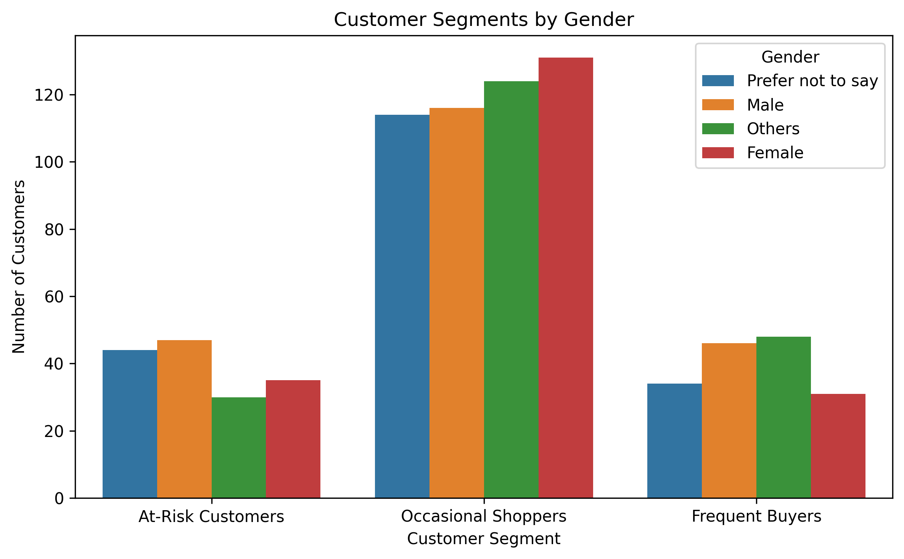

---

## 🤖 K-Means Clustering

K-Means clustering was applied to group customers based on selected customer experience and rating-related features.

### Features Used

The model uses:

- `Shopping_Satisfaction`
- `Customer_Reviews_Importance`
- `Rating_Accuracy`
- `Personalized_Recommendation_Rating`

### Model Configuration

- **Number of clusters:** 3
- **Random state:** 42
- **Number of initializations:** 10

The model generates three cluster labels:

- Cluster 0
- Cluster 1
- Cluster 2

### Cluster Sizes

| Cluster | Number of Customers |
|---|---:|
| Cluster 0 | 302 |
| Cluster 1 | 258 |
| Cluster 2 | 240 |

The cluster numbers are algorithm-generated labels. They do not automatically represent high, medium, or low satisfaction. The meaning of each cluster should be determined by examining the feature values within each cluster.

### How K-Means Was Applied

Each customer was represented using four selected features:

- Shopping Satisfaction
- Customer Reviews Importance
- Rating Accuracy
- Personalized Recommendation Rating

K-Means then groups customers according to similarity across these features.

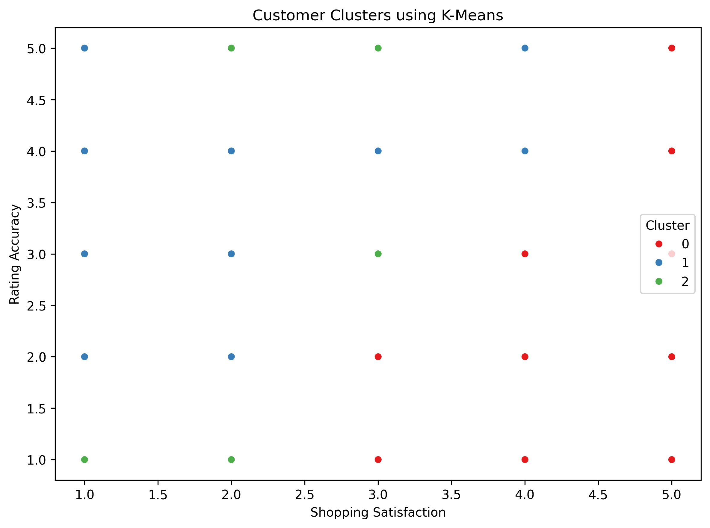

---

# ⭐ Task 4: Recommendation and Review Insights

## Recommendation Helpfulness and Shopping Satisfaction

The relationship between recommendation helpfulness and shopping satisfaction was analyzed using cross-tabulation and visualization.

### Key Findings

- Recommendation helpfulness responses are distributed across all shopping satisfaction levels.
- Customers selecting **Yes**, **Sometimes**, and **No** all reported satisfaction ratings ranging from **1 to 5**.
- No single recommendation-helpfulness category dominates one specific satisfaction level.
- The analysis does not show a strong relationship between recommendation helpfulness and overall shopping satisfaction.

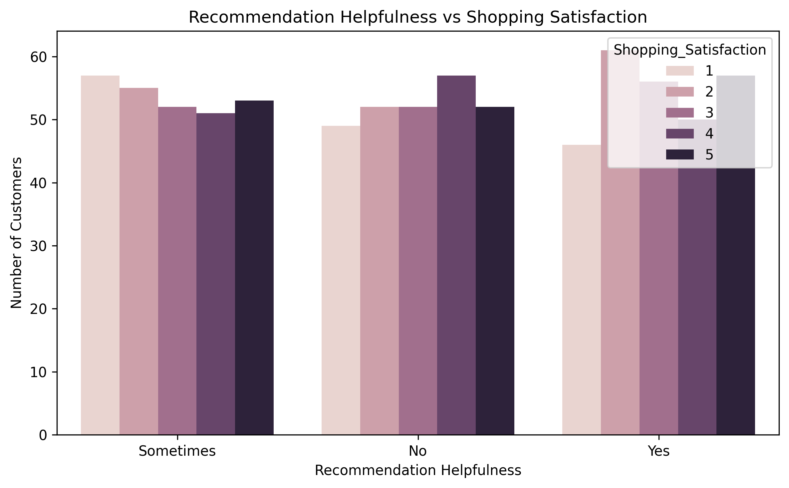

---

## Review Reliability

Customer perceptions of review reliability were analyzed.

### Key Findings

- **Heavily** is the most common response with **167 customers**.
- **Never** has **166 customers**.
- The remaining response categories are distributed relatively evenly.

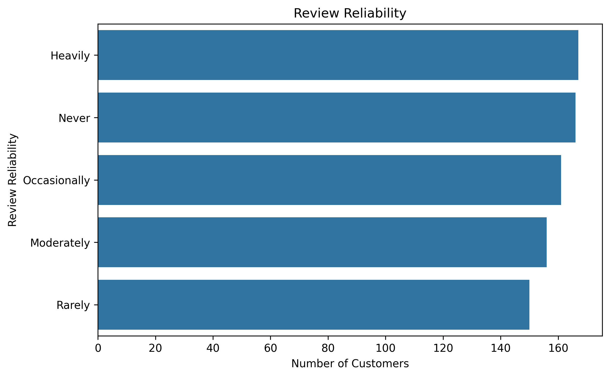

---

## Review Helpfulness

Customer opinions about the helpfulness of reviews were analyzed.

### Results

- **No:** 289 customers
- **Yes:** 257 customers
- **Sometimes:** 254 customers

The responses are relatively balanced, although **No** is the most common response.

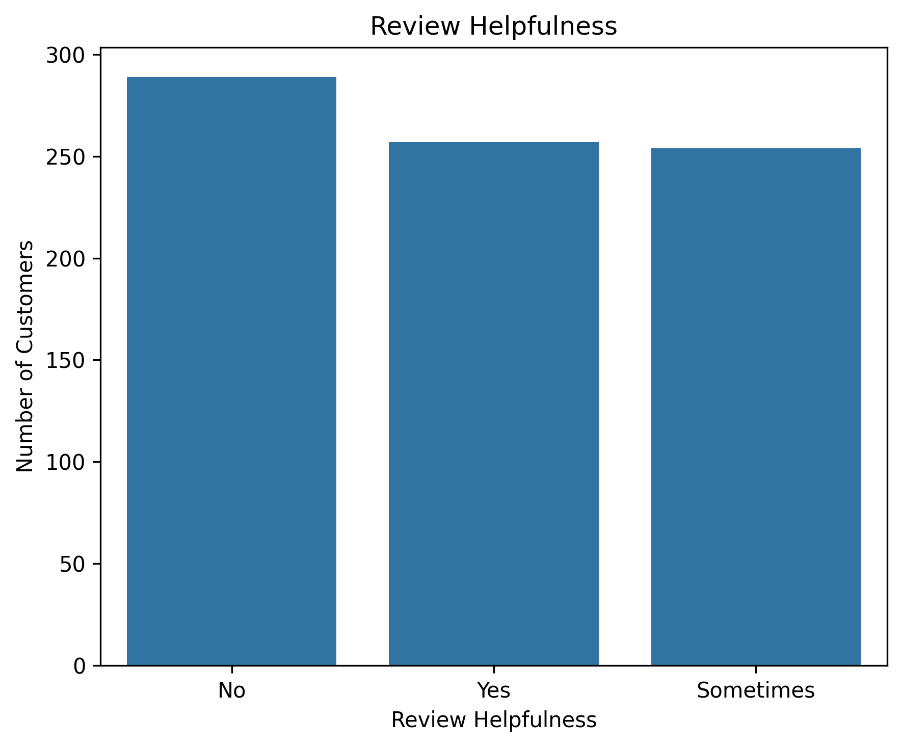

---

## Personalized Recommendation Analysis

Customer responses to personalized recommendations were analyzed.

### Results

- **Yes:** 278 customers
- **No:** 272 customers
- **Sometimes:** 250 customers

The responses are relatively balanced across the three categories.

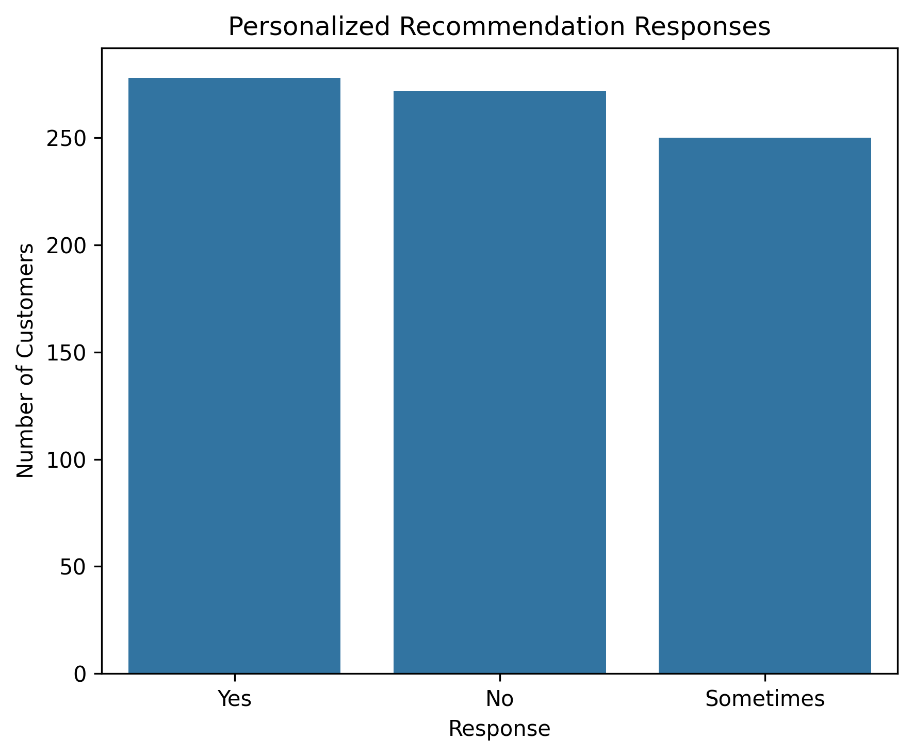

---

## Service Appreciation

The project analyzes which services customers appreciate most.

### Key Findings

- **Customer service:** 181 responses
- **Quick delivery:** 104 responses
- Wide product selection, competitive prices, and user-friendly website/app experience are also represented in the responses.

Customer service and quick delivery are among the most frequently appreciated services.

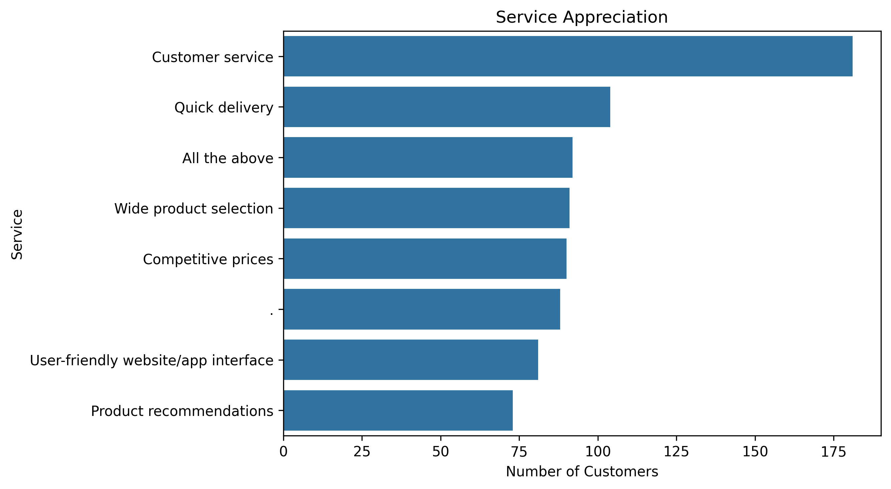

---

## Areas for Improvement

Customer feedback regarding areas that require improvement was analyzed.

### Key Findings

- **User Interface** is one of the frequently mentioned improvement areas with **56 responses**.
- Product quality and accuracy are also identified as improvement areas.
- Refund issues are another reported concern.
- Shipping speed, customer service responsiveness, and product recommendations are also represented in the responses.
- Some customers reported no specific problems.

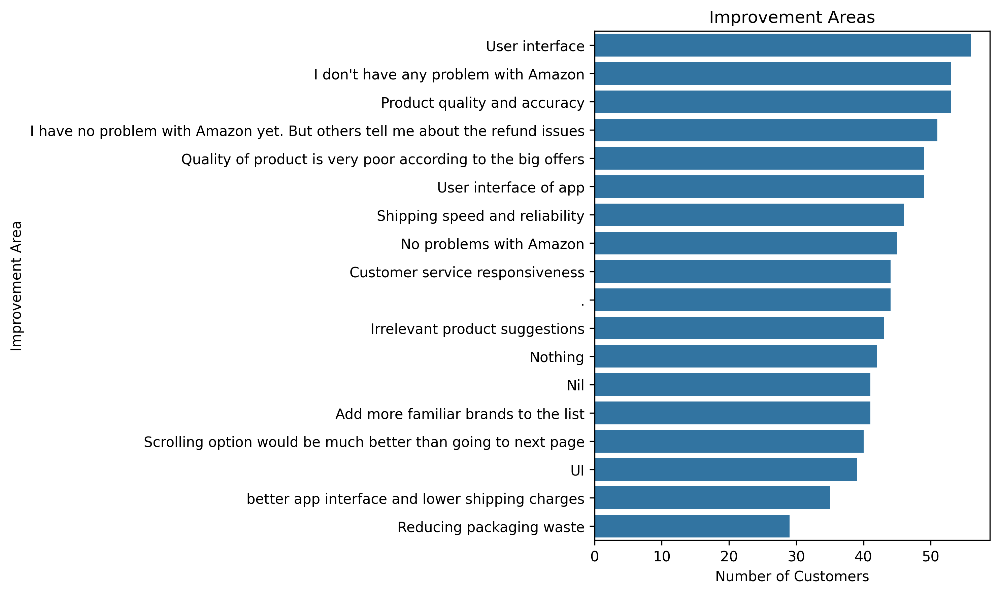

---

# 📊 Task 5: Visualization and Reporting

The project contains visualizations for the major areas of analysis, including:

- Age distribution
- Gender distribution
- Purchase frequency
- Browsing frequency
- Purchase categories
- Product search methods
- Cart abandonment
- Customer segments
- Customer segments by gender
- Shopping satisfaction
- Review reliability
- Review helpfulness
- Personalized recommendation responses
- Recommendation helpfulness and satisfaction
- Service appreciation
- Improvement areas
- K-Means clusters

---

# 💡 Key Business Insights

- **Clothing and Fashion** has the highest number of product-category selections.
- **Keyword Search** is the most commonly used product search method.
- **High shipping costs** are the most frequently recorded cart abandonment factor.
- **Once a month** is the most common purchase frequency.
- **Occasional Shoppers** form the largest customer segment.
- **Customer service** is one of the most appreciated services.
- **Quick delivery** is another highly appreciated service.
- **User Interface** is one of the frequently mentioned improvement areas.
- Customer opinions about review helpfulness and reliability vary across the dataset.
- Personalized recommendation responses are relatively balanced between Yes, No, and Sometimes.
- Shopping Satisfaction, Rating Accuracy, and Personalized Recommendation Rating have average values close to 3.
- K-Means clustering identifies three groups of customers based on the selected satisfaction and rating-related variables.

---

# 🔄 Project Workflow

Amazon Customer Dataset
↓
Data Inspection
↓
Data Cleaning and Preparation
↓
Descriptive Behavior Analysis
↓
Customer Demographics Analysis
↓
Purchase Frequency Analysis
↓
Product Category Analysis
↓
Product Search Analysis
↓
Cart Abandonment Analysis
↓
Customer Segmentation
↓
K-Means Clustering
↓
Recommendation and Review Analysis
↓
Service and Improvement Analysis
↓
Visualization and Reporting
↓
Business Insights

---

# 🧰 Skills Demonstrated

- Python
- Pandas
- NumPy
- Data Cleaning
- Data Preprocessing
- Exploratory Data Analysis
- Data Visualization
- Customer Behavior Analysis
- Customer Segmentation
- Unsupervised Machine Learning
- K-Means Clustering
- Statistical Analysis
- Business Insight Generation

---

# ⚠️ Project Scope and Limitation

Although the project is titled **Market Basket Analysis with Python - Amazon**, the implemented analysis primarily focuses on Amazon customer shopping behavior, purchasing categories, customer segmentation, satisfaction, reviews, recommendations, cart abandonment, and customer experience.

Traditional transaction-level association-rule mining techniques such as **Apriori, FP-Growth, Support, Confidence, and Lift** are not implemented in the current notebook.

The project instead uses customer behavior analysis and K-Means clustering to understand customer patterns and groups.

---

# 🚀 Future Improvements

Possible future extensions include:

- Implementing traditional association-rule mining
- Using transaction-level product data
- Applying Apriori or FP-Growth
- Calculating Support, Confidence, and Lift
- Performing deeper customer cluster profiling
- Evaluating different numbers of K-Means clusters
- Building an interactive dashboard
- Developing a recommendation system using transaction-level purchase data

---

# ▶️ How to Run the Project

1. Clone or download the repository.
2. Keep `Amazon.csv` and `Market_Basket_Analysis_Amazon.ipynb` in the project directory.
3. Open `Market_Basket_Analysis_Amazon.ipynb` using Jupyter Notebook or JupyterLab.
4. Install the required Python libraries if they are not already installed.
5. Run the notebook cells from beginning to end.
6. Review the generated analysis and visualizations.

---

# 📌 Conclusion

This project demonstrates the use of Python for analyzing Amazon customer shopping behavior and extracting meaningful insights from customer data.

The project combines data cleaning, exploratory analysis, customer segmentation, K-Means clustering, recommendation analysis, review analysis, visualization, and business insight generation.

The analysis provides a structured view of customer purchasing patterns, product discovery behavior, cart abandonment factors, satisfaction levels, customer segments, and areas for improving the overall customer shopping experience.

---

# 👩‍💻 Author

**Suhani**

